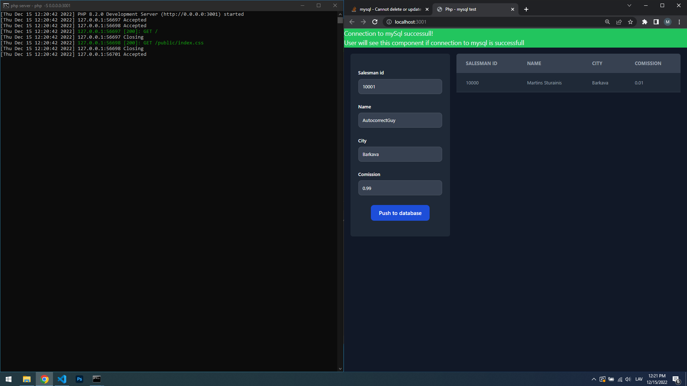
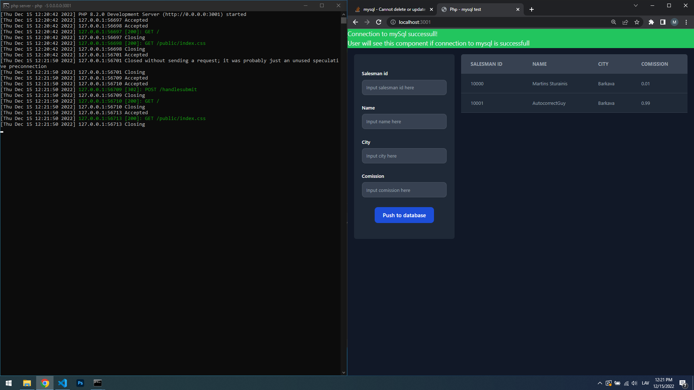

# Relāciju datubāžu apguve

Viena lapa, ar kuru var veikt izmaiņas datubāzē.
- Serveris: `php`;
- Datubāze: `mysql`;
- arhitektūra: `mvc`. 

Pirms

Pēc


Darbs nav pat tuvu pabeigts. Šobrīd viss, ko ar lapu var izdarīt, ir augšuplādēt datus vienā tabulā.

Ko es izdarīju savādāk, nekā iepriekšējo reizi:
  - sekmīgāka mapju struktūra. It īpaši iekš src​ un views​;
  - pats labprātīgi sāku izmantot klases un reizēm pat mantošanu. Man nesen tieši bija viens neliels VBA projekts un tur es sapratu, ka OOP stilā viss būtu daudz vienkāršāk. To es arī drīz augšuplādēšu githubā. Nepatīk VBA, bet viņš pašam noder dabojot skolēniem darbus un ne tikai man;
  - izmntoju yarn, nevis npm. Nez kāpēc biju iedomājies iepriekšējā reizē, ka yarn​ nestrādās kopā ar php​. 😄. Vienkārši biju nobijies laikam jo php​ nepārtraukti staigāju kā pa mīnu lauku;
  - nedaudz pamācījos batch​ windows skriptingu. Priekš manis ļoti noderīgi. Nav katru reizi, lai restartētu serveri jāraksta komandas priekš katra izmantotā porta;
  - pārliecinošāk izmantoju tailwind. Vispār vairs nedomāju par frontendu, tas jau ir kā ūdens pat ar vanilla html,css,js. Ņemu visu no flowbite​ kur ir jau gatavi komponenti. Līdzīgi kā bootstrap​, tikai man viņš nepatīk, jo viņš pārāk ierobežots. Tādēļ tieši pārgāju uz tailwind​.
  - composer ieliku sev ērtākā mapē. Nedaudz papraktizējos un tagad bez googles varu pats viņu konfigurēt.

<br/>
<br/>
<br/>
<br/>
<br/>
<br/>

# Kļūdu dienasgrāmata
---
## 13.12.2022 - mysqli kļūda

Pakāsu kādas 2 stundas meklējot iemeslu, kādēļ nevaru izmantot php `mysqli`.
  1. Izveidoju jaunu `php.ini` failu balstoties uz `php.ini-production` kopijas *(jo dokumentācija ieteica izmantot šo failu, nevis -development versiju)*.
  2. Failā `php.ini` atkomentēju `extension=mysqli`.
  3. Pārvietoju pārdēvēju pašu `php` mapi par `php`. Noņēmu versijas numuru. To darīju, jo uzmetoties kļūdai `PHP Fatal error: Uncaught Error: Class 'mysqli' not found in` kā avots tika uzrādīts `C:\php\ext\`.
  4. Pārmainīju vides mainīgos (environment variables) uz attiecīgi jaunajai php atrašanās vietai. 

## 14.12.2022 - composer

1. Komanda `composer init` izveido `vendor/composer` mapi ar visu, kas nepieciešams `composer` pluginā. Bet ar to nepietiek.
2. Modificēju `composer.json` failu, lai atvieglotu `namespace` pierakstu. Tagad tas ir `"App\\": "./"` (visam priekšā būs `App`).
3. Pēc tam, kad ir modificēts `composer.json` vajag palaist komandu `composer update` un tad var `index.php` importēt `autoload.php` failu no `./vendor/autoload.php`. 
4. Kādēļ `autoload.php` neieliekas `composer` mapītē? Joprojām nezinu, bet tas daudz nesarežģī dzīvi. 

## 14.12.2022 - javascript onsubmit

1. Izrādās, parastajos html failos js sintakse var būtiski atšķirties. `form` tegā `onsubmit` izrādās, ka nepieciešams `atgriezt` vērtību, nevis tikai padot funkciju, kā tas ir `react`.
2. Nepareizi ```onsubmit="handleSubmit(event)"```; pareizi ```onsubmit="return handleSubmit(event)"```;

## 15.12.2022 
1. Beigās tāpat neizmantoju `js`, lai veiktu `CRUD` izmaiņas datubāzē, izmantoju `php`. Kad būs brīvais laiks, tā ir viena no pirmajām lietām, kas jāizpēta, jo tas ir piemirsies.

# 16.12.2022

1. TODO: tagad inputfiels un tabula nerenderējas, ja tabulā nav vismaz viena ieraksta. Izveidot normālu vaicājumu gadījumam, ja tabulā nav neviena ieraksta. 
```sql
select * from `mytable` or else describe `myTable`
```  

2. TODO: uzlikt pareizus `headers` localtunnelim, lai nerādītos, ka tas ir locatunnel savienojums.

3. ...